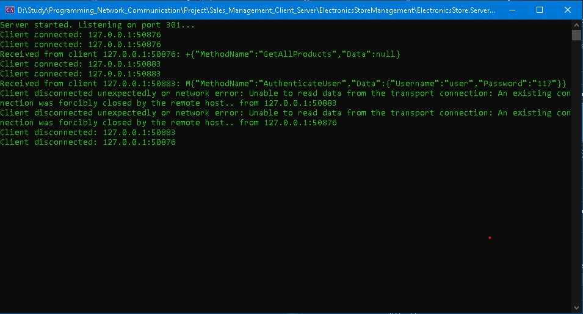
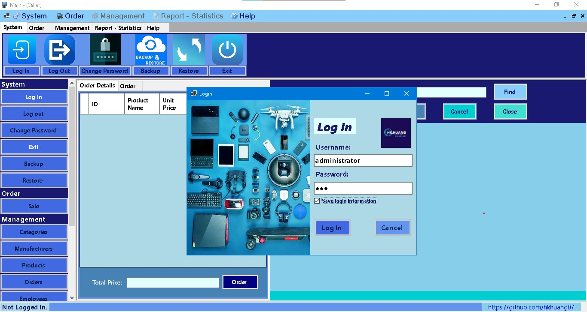

# 🚀 Sales Management System - Client-Server Model (Socket- Multi Threads Process -.NET Entity Framework) 📈
**Project is Developing...**
## Project Overview

Welcome to the **Sales Management System**! This repository presents a powerful and intuitive solution specifically crafted for electronics stores. Built on a robust **Client-Server architecture**, this system shines with its ability to handle concurrent operations through **multi-threading**, all while adhering to a clean **3-Layer Architecture** for unparalleled maintainability, scalability, and rock-solid data integrity. At its core, data persistence is masterfully managed using **.NET Entity Framework** and **SQL Server**.
<p align="center">
  <h3>Server & Client Overview  (Developing) </h3>
  
   
   <p><em> Server Console & Client Interface.</em></p>
</p>
## ✨ Key Features & Highlights ✨

Here's what makes this project stand out:

* **🌐 Client-Server Model with Multi-threading:**
    * **Server Core:** Our dedicated server application (`Program.cs`) acts as the central hub, constantly listening for incoming client connections on a specific port (e.g., `301`). 👂
    * **⚡ Multi-threaded Processing:** Experience blazing-fast responsiveness! Each new client connection is elegantly handled **asynchronously** using `Task.Run(() => ServerHandler.HandleClientAsync(client))`. This ensures the server can process countless client requests simultaneously without a hint of blocking, significantly boosting performance and throughput. 🚀
    * **🔌 Socket Communication:** We utilize raw TCP sockets for direct, highly efficient, and low-latency communication between your clients and the server. This means data moves at lightning speed! 💨
    * **📦 Length-Prefixed Messaging:** To guarantee every byte arrives safely, we've implemented a custom, robust protocol. Message length is sent *before* the actual JSON payload, ensuring reliable message framing and complete data reception on both the client and server sides (`ClientService.cs`). No more truncated messages! ✅

* **📐 Elegant 3-Layer Architecture:**
    This system is meticulously organized into three distinct layers, promoting modularity and ease of development:
    * **🖥️ Client Layer (`ElectronicsStore.Presentation`, `ElectronicsStore.Client`):** The user's gateway! This is our sleek Windows Forms UI application, coupled with the `ClientService`, which is solely responsible for captivating user interaction, seamlessly sending requests to the server, and beautifully displaying the responses. 🎨
    * **⚙️ Server Layer (`ElectronicsStore.Server`):** The intelligent dispatcher! The `ServerHandler` component on the server side efficiently receives incoming client requests, gracefully deserializes them, intelligently invokes the appropriate business logic, and meticulously crafts and sends back the responses. 🧠
    * **🧠 Business Logic Layer (BLL - `ElectronicsStore.BusinessLogic`):** The brain of the operation! This layer encapsulates all the core business rules and sophisticated operations (e.g., `EmployeeService`, `OrderService`, `ProductService`). The BLL orchestrates the entire data flow, performs critical validations, and executes complex processing logic. **Data Transfer Objects (DTOs)** are extensively used for clean and efficient data exchange between the BLL and other layers. 🔄
    * **🗄️ Data Access Layer (DAL - `ElectronicsStore.DataAccess`):** The data guardian! This layer is dedicated to seamless interaction with the database. It houses powerful repositories (e.g., `IOrderRepository`, `OrderRepository`) that abstract away the complexities of the underlying data storage mechanism, ensuring the BLL remains blissfully independent of the specific database technology.🛡️

* **💾 Robust Data Management with .NET Entity Framework & SQL Server:**
    * **Persistent Storage:** **SQL Server** stands as our robust, reliable relational database, meticulously storing every piece of application data – from products and orders to customer details and employee records. Your data is safe and sound! 🔒
    * **✨ .NET Entity Framework:** We harness the power of this cutting-edge ORM (Object-Relational Mapper) to effortlessly interact with the SQL Server database. This magical tool simplifies all data operations, enforces strong type-safety, and dramatically reduces boilerplate code for database interactions. Code less, achieve more! 🚀
    * **🛡️ Tight Data Integrity:** Thanks to the synergistic capabilities of Entity Framework and the inherent features of SQL Server, we guarantee unparalleled data consistency and integrity across all entities and their intricate relationships (e.g., the vital connections between customers, employees, and products with orders). Your data will always be accurate and reliable. ✅

## Project Structure (Conceptual)
```
├── ElectronicsStore.sln
├── ElectronicsStore.Client (Windows Forms UI, ClientService for server communication)
│   ├── ClientService.cs
│   ├── frmMain.cs
│   └── ... (Other UI forms)
├── ElectronicsStore.Server (Server application for handling client requests)
│   ├── Program.cs (Main server entry point)
│   └── ServerHandler.cs (Handles client requests, invokes BLL)
├── ElectronicsStore.BusinessLogic (Business Logic Layer)
│   ├── OrderService.cs
│   ├── EmployeeService.cs
│   ├── ProductService.cs
│   └── ... (Other service classes)
├── ElectronicsStore.DataAccess (Data Access Layer)
│   ├── IOrderRepository.cs
│   ├── OrderRepository.cs
│   ├── ElectronicsStoreContext.cs (EF Core DbContext)
│   └── ... (Other repository interfaces and implementations)
├── ElectronicsStore.DataTransferObject (DTOs for data exchange)
│   ├── OrderDTO.cs
│   ├── ProductDTO.cs
│   ├── LoginRequestDTO.cs
│   ├── LoginResponseDTO.cs
│   └── ... (All other DTOs)
└── ElectronicsStore.Models (Entity Framework Core models/entities)
├── Orders.cs
├── Employees.cs
├── Customers.cs
├── Products.cs
├── Order_Details.cs
└── ... (All other database entities)
```

## 🚀 How to Run (General Steps) 🚀

Getting this system up and running is straightforward:

1.  **🗃️ Database Setup:**
    * Ensure **SQL Server** is installed and purring. 🐢
    * Restore the database backup (if provided) or simply run **Entity Framework migrations** to automatically sculpt the database schema. 🛠️
    * **Crucially**, update the connection strings in `appsettings.json` (or `App.config` for older projects) within both the Server and potentially Client projects to point directly to your SQL Server instance. 🔗

2.  **💻 Server Application:**
    * Open the entire solution in **Visual Studio**. 📂
    * Build the `ElectronicsStore.Server` project. 🏗️
    * Execute the `ElectronicsStore.Server` application. Watch as it gracefully starts listening on the configured port (defaulting to `301`). 👂

3.  **🖥️ Client Application:**
    * Build the `ElectronicsStore.Client` project. 🏗️
    * Launch the `ElectronicsStore.Client` application (e.g., `frmMain`). 🏁
    * Double-check that the `ServerIp` and `ServerPort` configured in the client perfectly match the server's listening address and port. Seamless connection guaranteed! 🤝

## 👤 Author 👤

**Huynh Quoc Huy**

* **GitHub Profile:** [https://github.com/hkhuang07](https://github.com/hkhuang07) 🌟
* **Project Repository:** [https://github.com/hkhuang07/Sales-Management-Client-Server-Model-Socket-Multil-Threads](https://github.com/hkhuang07/Sales-Management-Client-Server-Model-Socket-Multil-Threads) 🔗
