# 🛒 Electronic Store Management System - Client-Server Architecture ⚡

> **High-Performance C# .NET WinForms & TCP Socket Multi-Threaded System**  
> Built with 4-Layer Clean Architecture, Unit of Work & Repository Patterns, EF Core & SQL Server.

---

## 📌 Project Overview

Welcome to the **Electronic Store Management System**! This repository presents a modern, production-grade enterprise software solution tailored specifically for electronic store retail and inventory management. 

Beyond a standard desktop application, this system implements an event-driven **Client-Server architecture** communicating over raw **TCP Sockets with Multi-threading**, ensuring ultra-fast response times, concurrent user handling, data integrity, and high operational reliability.

---

## 🎬 System Demos & Visual Showcase

### 1. POS Sales & Transaction Process
Real-time interaction between Client POS interface and Server backend console.

<p align="center">
  
  <br><em>Real-Time POS Sales Processing Flow</em>
</p>

### 2. Server Console & Client Dashboard
<p align="center">
  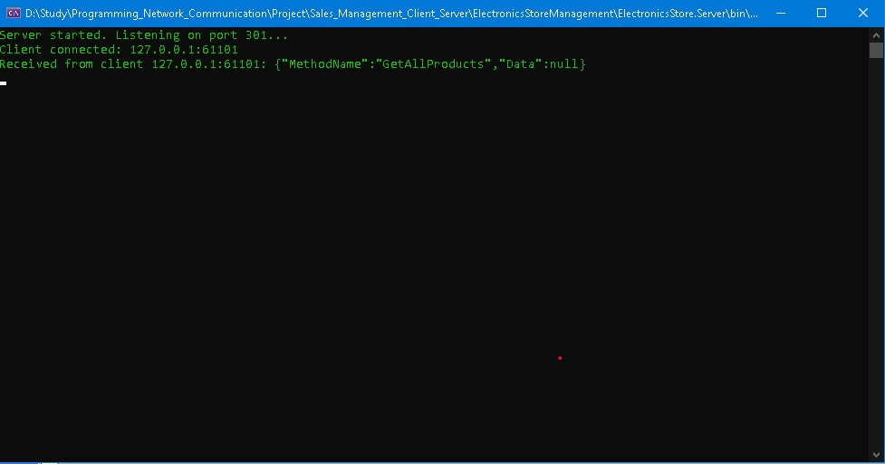
  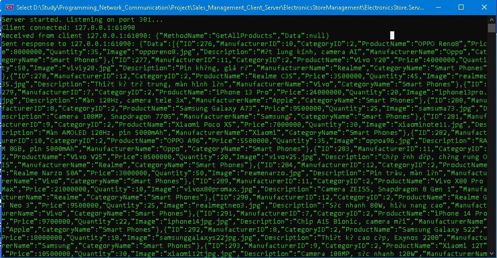
  <br>
  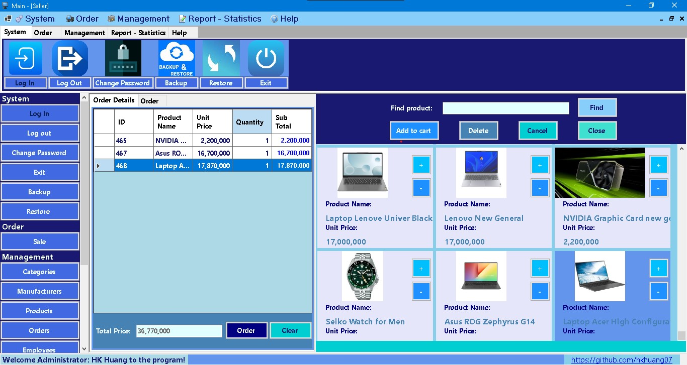
  <br><em>Server Control Console & Client Main Interface Overview</em>
</p>

---

## 📸 Media Gallery & Feature Showcase

### 🔐 Secure Authentication & Role-Based Access
Strict authentication mechanism separating standard employees from system administrators.

<p align="center">
  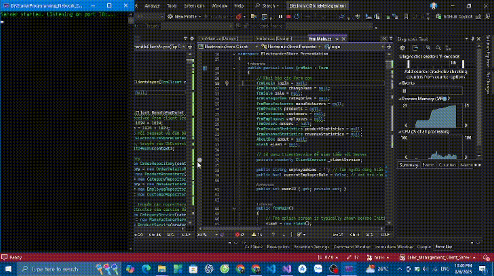
  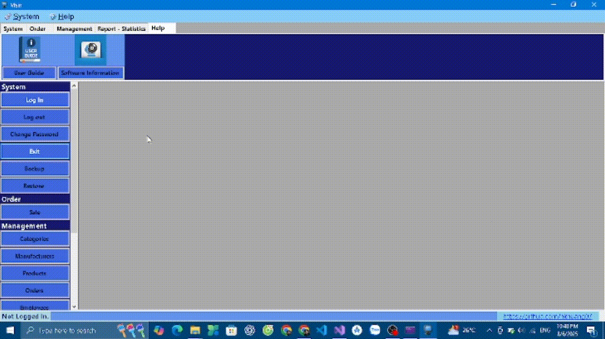
  <br><em>Staff Authentication (Left) vs Administrator Privileged Authentication (Right)</em>
</p>

### 📦 Inventory & Catalog Management
Full CRUD control over Product Categories, Manufacturers, and Product Items.

<p align="center">
  <b>Category Management</b><br>
  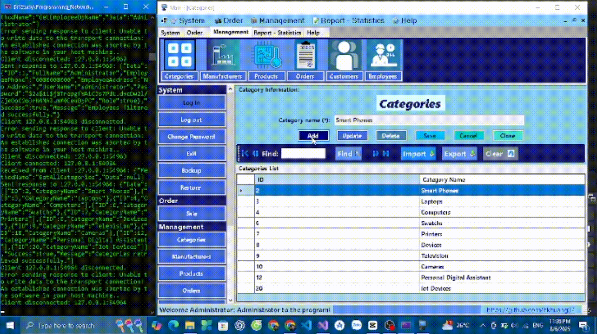
</p>
<p align="center">
  <b>Manufacturer Directory</b><br>
  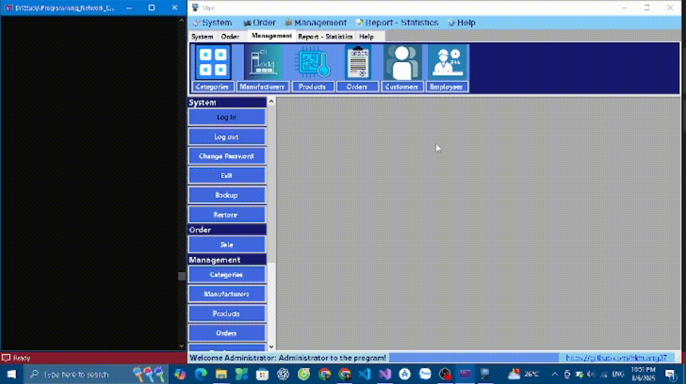
</p>
<p align="center">
  <b>Product Catalog & Stock Management</b><br>
  
</p>

### 👥 Customer & Employee Stakeholder Records
<p align="center">
  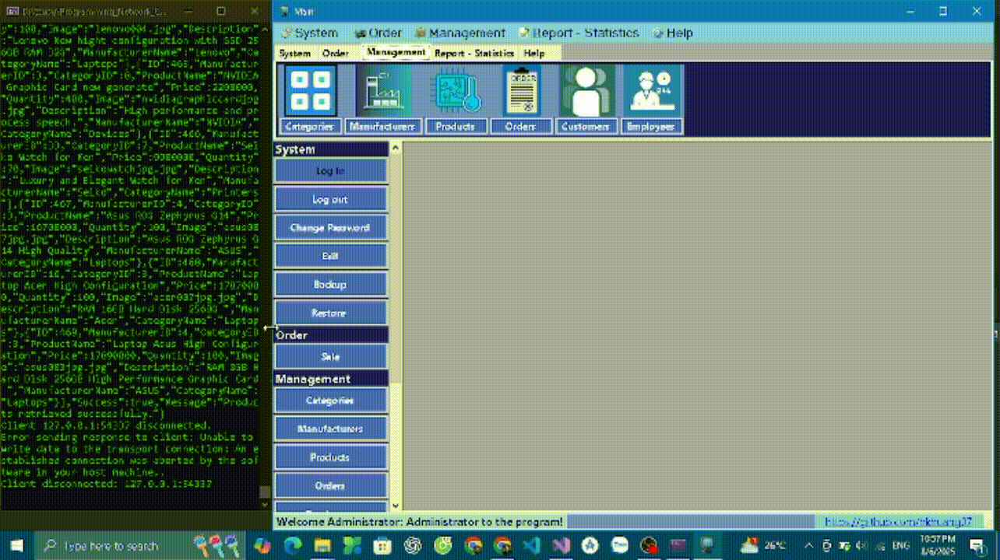
  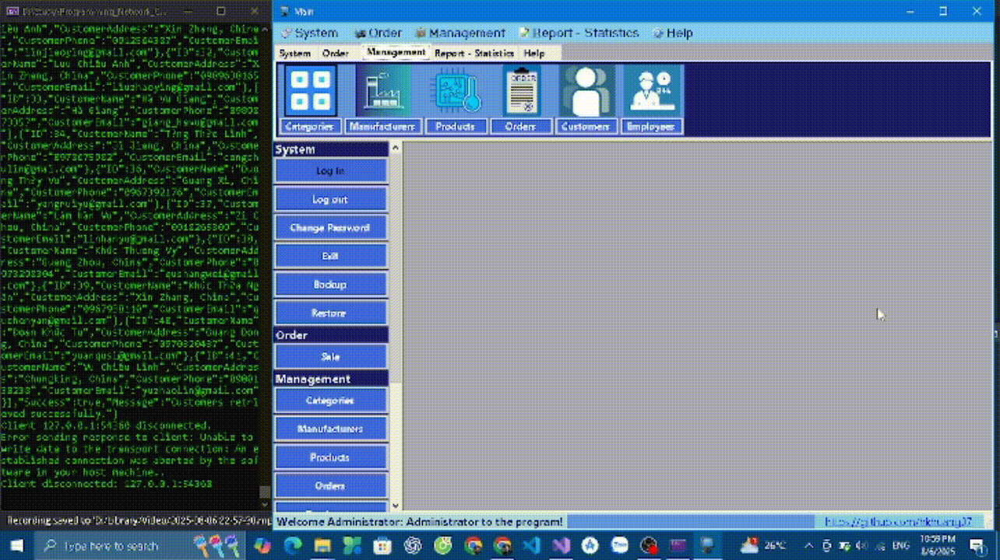
  <br><em>Customer Relationship Management (Left) & Staff Management (Right)</em>
</p>

### 🧾 POS Order Processing & Invoice Printing
Order creation with automated stock calculation, transaction locking, and receipt generation.

<p align="center">
  
  <br><em>Order & Line Item Details Processing</em>
</p>

### 📊 Real-time Business Analytics & Reporting
Graphical reports for product sales volume trends and total revenue statistics.

<p align="center">
  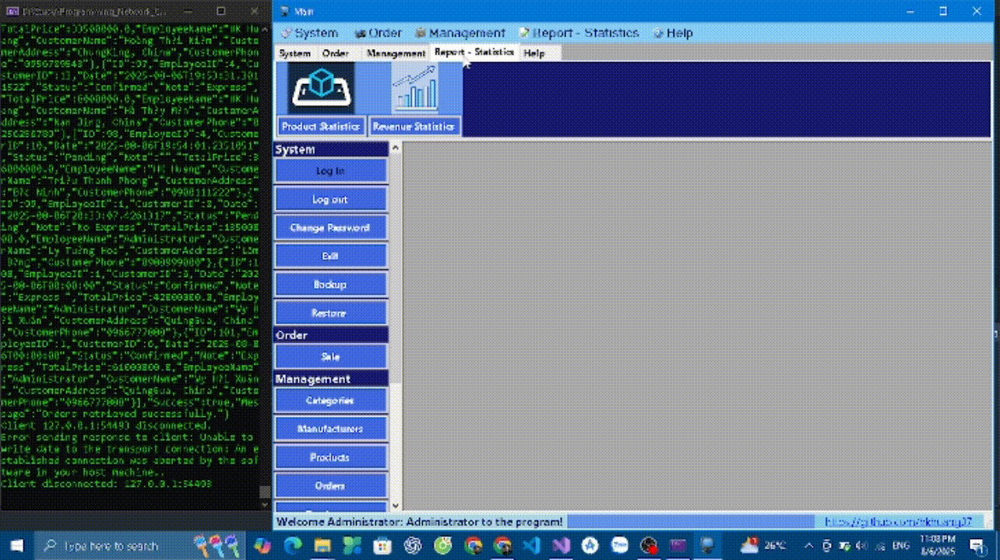
  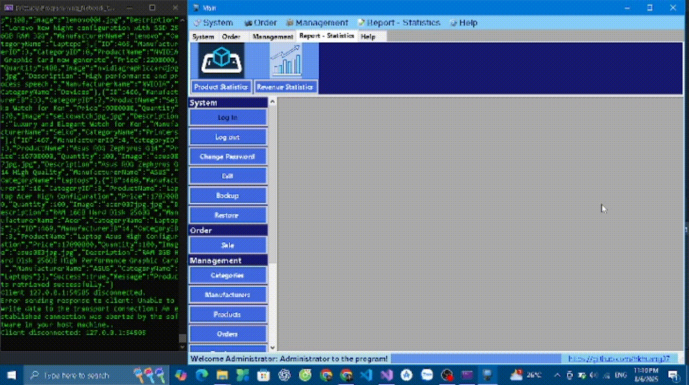
  <br><em>Product Sales Volume Analytics (Left) & Revenue Trend Analysis (Right)</em>
</p>

### ❓ Integrated Help Center & Software Details
<p align="center">
  
  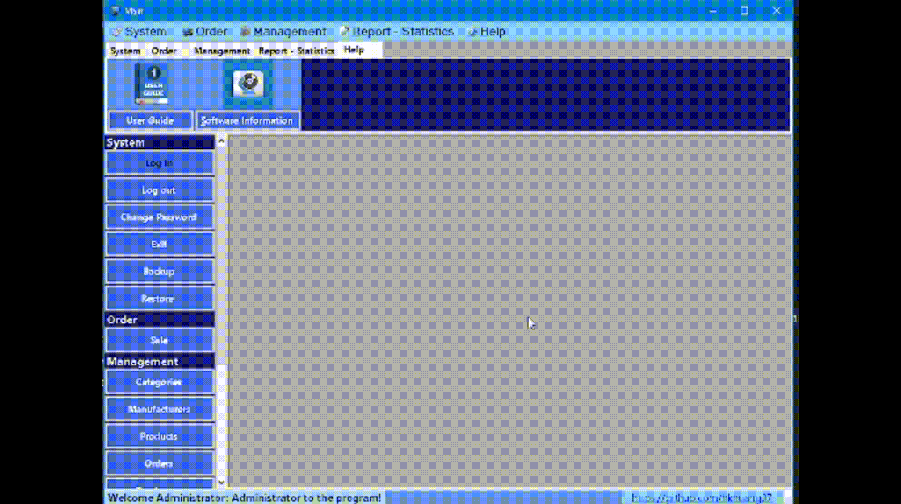
  <br><em>Web Help Center Documentation (Left) & System Version Info (Right)</em>
</p>

---

## 🏗️ System Architecture & Technologies

### 📐 High-Level Architecture Diagram

```text
┌─────────────────────────────────────────────────────────────────────────────┐
│                    Electronic Store Management System                       │
├──────────────────────────────────────┬──────────────────────────────────────┤
│     Presentation Layer (Client)      │       Server Layer (Backend Core)    │
│     C# .NET 8 WinForms POS UI        │       ASP.NET Core 8 Web API         │
│     HttpClient & Polly Resilience    │       SignalR Real-Time Hub          │
│     JWT Bearer Authentication        │       Serilog Structured Logging     │
├──────────────────────────────────────┴──────────────────────────────────────┤
│               Business Logic Layer (BLL) & DTOs Layer                       │
│               OrderService, ProductService, EmployeeService, etc.           │
│               Data Transfer Objects (DTOs) & Newtonsoft.Json                │
├─────────────────────────────────────────────────────────────────────────────┤
│               Data Access Layer (DAL) & Entity Framework Core               │
│               Unit of Work Pattern (IUnitOfWork) & Repository Pattern       │
│               EF Core 9 DbContext + Interceptor Audit Logging               │
├─────────────────────────────────────────────────────────────────────────────┤
│                      SQL Server / LocalDB Database                          │
│               Relational DB (Category, Product, Customer, Employee, Order)  │
└─────────────────────────────────────────────────────────────────────────────┘
```

---

## 🛠️ Core Technologies & Architectural Patterns

### 1. ⚡ Real-Time ASP.NET Core & SignalR
- **RESTful API Core**: The system now exposes standardized, secured REST endpoints (HTTP/HTTPS) using ASP.NET Core Web API instead of raw TCP Sockets. This allows easy integration with external services and scalable load balancing.
- **SignalR Real-time Data**: Utilizes `@microsoft/signalr` to push real-time updates directly to connected WinForms clients, keeping multiple POS dashboards in sync synchronously.

### 2. 🛡️ Unit of Work, Repository Pattern & Audit Interceptors
- **Atomic Transactions**: Ensures all database changes execute inside a single transaction context via `IUnitOfWork`.
- **Entity Framework Core Interceptors**: Automatic audit logging interceptor seamlessly tracks every CRUD operation with timestamp and changes.

### 3. 🎯 5-Layer Clean Code Solution Structure
- **`Presentation/`**: Rich WinForms client interface built for fast desktop POS operation, now armed with Polly retry resilience.
- **`Server/`**: High-performance ASP.NET Core API server with JWT Auth, Serilog logging, and SignalR hub.
- **`BusinessLogicLayer/`**: Core business domain logic, validation rules, and DTO orchestration.
- **`DataAccessLayer/`**: EF Core `DbContext`, Entity models, Repositories, and Data Seeding.
- **`DataTransferObject/`**: Clean DTO classes for JSON network exchange.

---

## 📂 Project Directory Structure

```
Electronic-Store-NET-Winform-Socket-MultilThreads/
├── demo/                             # Demo screenshots, diagrams, and video GIFs
├── src/                              # Source code directory
│   ├── Presentation/                 # Client WinForms UI App (ElectronicsStore.Client)
│   ├── Server/                       # Server Application (ElectronicsStore.Server)
│   ├── BusinessLogicLayer/           # BLL Services & Business Rules
│   ├── DataAccessLayer/              # EF Core DbContext, Repositories, Migrations & DataSeeder
│   ├── DataTransferObject/           # DTO classes for JSON network exchange
│   └── ElectronicsStoreManagement.sln # Visual Studio Solution file
└── README.md                         # Project documentation
```

---

## 🚀 Deployment & Installation Guide

Follow these steps to deploy and run the system locally:

### 1. 📋 Prerequisites
- **.NET 8.0 SDK** or higher installed.
- **Visual Studio 2022** (with .NET Desktop Development workload).
- **SQL Server 2019+** or **SQL Server LocalDB**.

### 2. 📥 Download Source Code
```bash
git clone https://github.com/hkhuang07/Electronic-Store-NET-Winform-Socket-MultilThreads.git
cd Electronic-Store-NET-Winform-Socket-MultilThreads
```

### 3. 🗄️ Database Setup & EF Core Model Migration
1. Configure your SQL Server connection string in `src/Server/appsettings.json` or `ElectronicsStoreContext.cs`:
   ```json
   "ConnectionStrings": {
     "DefaultConnection": "Server=.;Database=ElectronicsStoreDB;Trusted_Connection=True;TrustServerCertificate=True;"
   }
   ```
2. Run EF Core Migration & Model Data Seeding to automatically build schema and insert seed data (Categories, Manufacturers, Employees, Products, Customers):
   ```bash
   dotnet ef database update --project src/DataAccessLayer --startup-project src/Server
   ```
   *(Or run `Update-Database` in Visual Studio Package Manager Console)*.

### 4. 🖥️ Running the Application

1. **Start the Server Application First**:
   ```bash
   dotnet run --project src/Server/ElectronicsStore.Server.csproj
   ```
   *The server console will start listening on `0.0.0.0:301`.*

2. **Launch the Client POS Application**:
   ```bash
   dotnet run --project src/Presentation/ElectronicsStore.Client.csproj
   ```
   - Log in using default seed credentials (passwords are strictly verified via BCrypt hashing):
     - **Admin**: Username `linsirui` | Password `1111111111`
     - **Staff**: Username `huynhquochuy` | Password `0000000000`

---

## 👤 Author & License

**Huỳnh Quốc Huy**
- **GitHub**: [hkhuang07](https://github.com/hkhuang07)
- **Repository**: [Electronic-Store-NET-Winform-Socket-MultilThreads](https://github.com/hkhuang07/Electronic-Store-NET-Winform-Socket-MultilThreads)

*Copyright © 2025 Huỳnh Quốc Huy. All Rights Reserved.*
